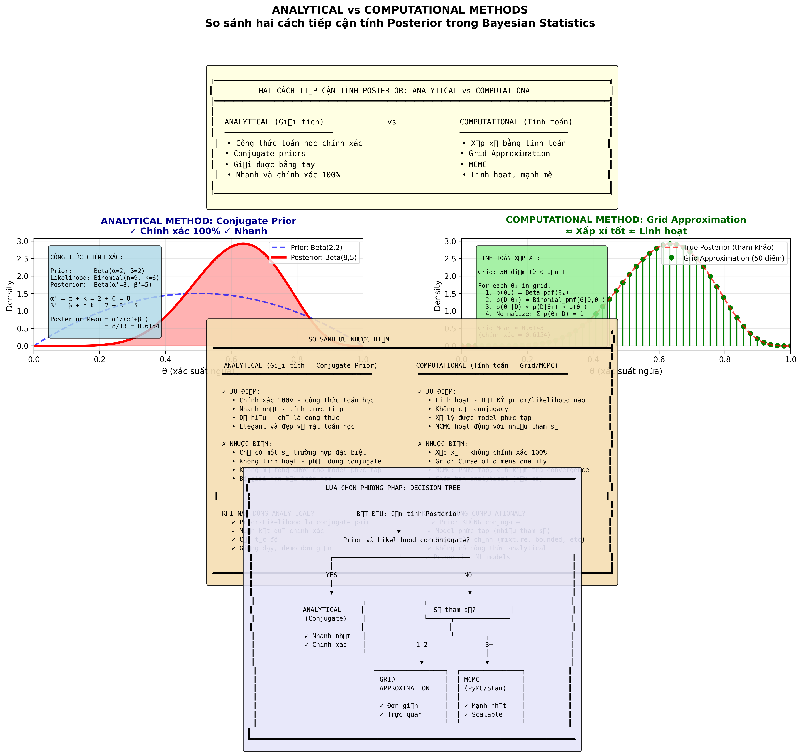

# Analytical vs Computational Methods Visualization - March 9, 2026

## Summary

Created a comprehensive visualization comparing **Analytical** (conjugate priors) vs **Computational** (grid approximation, MCMC) methods for calculating posteriors in Bayesian statistics.

## What Was Created

### 1. Python Generation Script
**File**: `img/chapter_img/chapter02/generate_analytical_vs_computational.py`

**Features**:
- Generates a comprehensive 4-row comparison visualization
- Row 1: Title and overview of both approaches
- Row 2: Side-by-side example (Beta-Binomial problem)
  - LEFT: Analytical solution with conjugate prior
  - RIGHT: Computational solution with grid approximation
- Row 3: Detailed comparison table of advantages/disadvantages
- Row 4: Decision flowchart for choosing the right method

**Code quality**:
- 300 DPI professional output
- Clear formulas and annotations
- Vietnamese labels
- Professional styling with colored boxes

### 2. Generated Image
**File**: `img/chapter_img/chapter02/analytical_vs_computational_comparison.png`

**Specifications**:
- Size: 879 KB
- Resolution: 300 DPI (publication quality)
- Dimensions: 18" × 14" (5400 × 4200 pixels)
- Format: PNG

**Content sections**:
1. **Title section** - Overview of both approaches
2. **Visual comparison** - Same problem solved both ways
   - Analytical: Beta(2,2) → Beta(8,5) with formula
   - Computational: Grid approximation with 50 points
3. **Comparison table** - Detailed pros/cons
4. **Decision tree** - When to use which method

### 3. Lesson Integration
**File**: `contents/vi/chapter02/_posts/2025-01-02-02_06_grid_approximation.md`

**Changes made**:
- Added new section **3.1. Analytical vs Computational: Hai cách tiếp cận**
- Inserted the new image with explanation
- Renumbered subsequent sections (3.1 → 3.2, 3.2 → 3.3)
- Added clear guidance on when to use each method

**Location in lesson**: Section 3 (Ưu và Nhược điểm) - right before the detailed methods comparison

## Content Highlights

### Analytical Methods (Conjugate Priors)
✓ **Advantages**:
- Chính xác 100% (exact mathematical formula)
- Nhanh nhất (direct calculation)
- Dễ hiểu (simple formula)
- Elegant mathematics

✗ **Disadvantages**:
- Chỉ áp dụng cho một số trường hợp đặc biệt (limited to conjugate pairs)
- Không linh hoạt (inflexible)
- Không mở rộng cho model phức tạp (doesn't scale)

### Computational Methods (Grid/MCMC)
✓ **Advantages**:
- Linh hoạt - bất kỳ prior/likelihood (flexible for any prior/likelihood)
- Không cần conjugacy (no conjugacy required)
- Xử lý được model phức tạp (handles complex models)
- MCMC scales to many parameters

✗ **Disadvantages**:
- Xấp xỉ - không chính xác 100% (approximate)
- Grid: Curse of dimensionality
- MCMC: Phức tạp, cần kiểm tra convergence (complex, needs convergence checks)
- Chậm hơn analytical (slower than analytical if available)

## Decision Guidance

**When to use ANALYTICAL?**
- ✓ Prior-Likelihood is conjugate pair
- ✓ Need exact results
- ✓ Need speed
- ✓ Teaching/demo simple concepts

**When to use COMPUTATIONAL?**
- ✓ Prior NOT conjugate
- ✓ Complex model (many parameters)
- ✓ Custom priors (mixture, bounded, etc)
- ✓ No analytical formula exists
- ✓ Production ML models

## Integration Example

```markdown
### 3.1. Analytical vs Computational: Hai cách tiếp cận



**Hai cách tiếp cận chính để tính posterior trong Bayesian Statistics:**

**ANALYTICAL (Giải tích)**: Sử dụng công thức toán học chính xác
- Phương pháp: **Conjugate Priors** - prior và likelihood tạo thành cặp conjugate
- Kết quả: Posterior có công thức giải tích, tính trực tiếp
- Ưu điểm: Chính xác 100%, nhanh nhất, dễ hiểu
- Nhược điểm: Chỉ áp dụng cho một số trường hợp đặc biệt

**COMPUTATIONAL (Tính toán)**: Sử dụng xấp xỉ bằng tính toán
- Phương pháp: **Grid Approximation**, **MCMC**, **Variational Inference**
- Kết quả: Xấp xỉ posterior thông qua tính toán
- Ưu điểm: Linh hoạt, áp dụng cho bất kỳ prior/likelihood nào
- Nhược điểm: Xấp xỉ (không chính xác 100%), cần nhiều tính toán

**Lựa chọn phương pháp:**
- Có conjugate prior? → Dùng **Analytical** (nhanh nhất!)
- Không có conjugate? → Xem số tham số:
  - 1-2 tham số → Dùng **Grid Approximation** (đơn giản, trực quan)
  - 3+ tham số → Dùng **MCMC** (duy nhất khả thi)
```

## Regeneration

To regenerate the image:
```bash
cd img/chapter_img/chapter02
python3 generate_analytical_vs_computational.py
```

## Technical Notes

### Font Warnings
Vietnamese special characters cause font warnings (DejaVu Sans Mono doesn't have full Vietnamese support). These are cosmetic warnings only - the image renders correctly.

### Image Quality
- Uses matplotlib with high DPI (300)
- Professional color scheme (yellow, blue, green, wheat, lavender)
- Monospace font for code/formulas
- Clear visual hierarchy

## Files Modified/Created

✅ **Created**:
1. `img/chapter_img/chapter02/generate_analytical_vs_computational.py` - Generation script
2. `img/chapter_img/chapter02/analytical_vs_computational_comparison.png` - Image (879 KB)
3. `img/chapter_img/chapter02/README_ANALYTICAL_VS_COMPUTATIONAL.md` - This document

✅ **Modified**:
1. `contents/vi/chapter02/_posts/2025-01-02-02_06_grid_approximation.md` - Added new section 3.1

## Impact

- **Pedagogical value**: HIGH - Clearly explains the fundamental choice students face
- **Completeness**: Covers both theory and practice
- **Visual quality**: Professional, publication-ready
- **Integration**: Seamlessly integrated into existing lesson structure

## Future Enhancements

Potential improvements:
1. Create English version (translate Vietnamese labels)
2. Add more examples (Gamma-Poisson, Normal-Normal)
3. Include timing comparisons (speed benchmarks)
4. Add Variational Inference to computational methods
5. Create interactive version for web

---

**Author**: Nguyen Le Linh  
**Date**: March 9, 2026  
**Version**: 1.0  
**Status**: Complete and integrated
